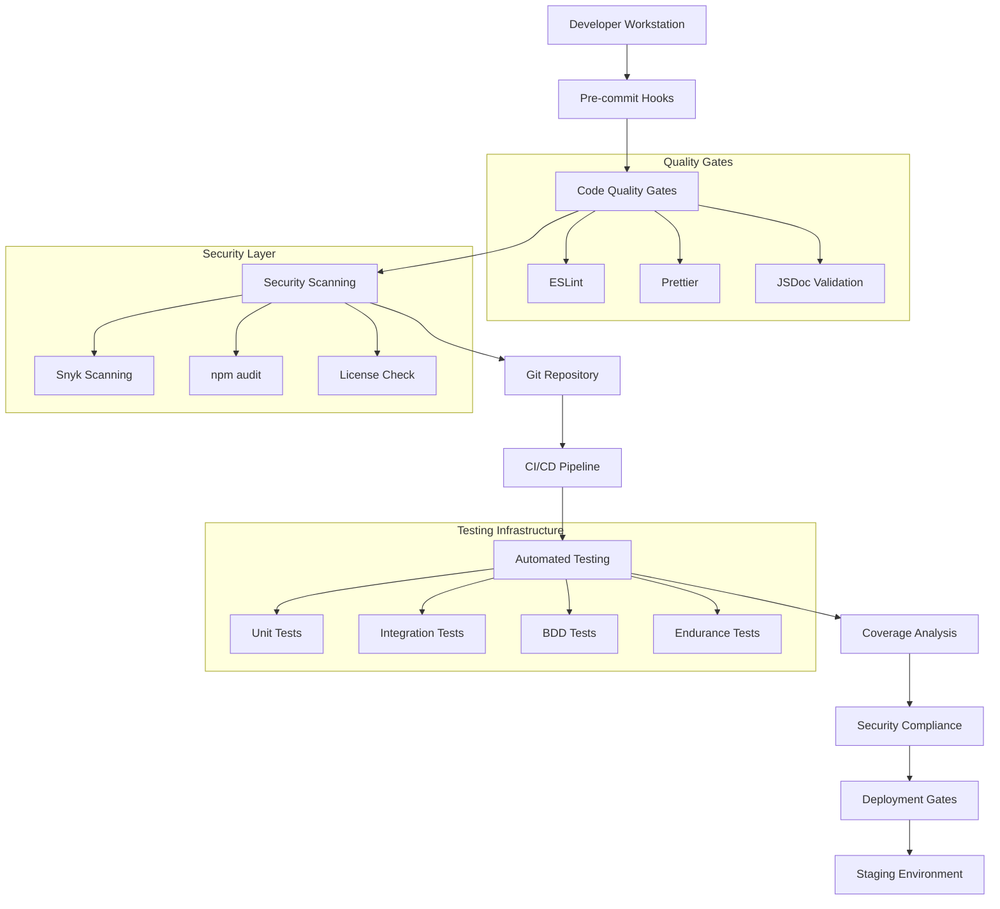

# Design Document

## Overview

The pre-development setup establishes a robust foundation for the AI Voice Verification Agent
project through automated quality assurance, security enforcement, and comprehensive testing
infrastructure. This design implements industry best practices for financial services software
development, ensuring compliance, security, and maintainability from project inception.

## Architecture

### Core Components



### Technology Stack Integration

- **Pre-commit Framework**: Husky + lint-staged for Git hook management
- **Code Quality**: ESLint + Prettier + JSDoc for consistent formatting and documentation
- **Security Scanning**: Snyk + npm audit + license-checker for vulnerability detection
- **Testing Framework**: Jest + Cucumber + Artillery for comprehensive test coverage
- **CI/CD Platform**: GitHub Actions with Docker-based pipeline execution
- **Coverage Analysis**: NYC/Istanbul with threshold enforcement
- **Documentation**: JSDoc + markdown-toc for automated documentation generation

## Components and Interfaces

### Pre-commit Hook System

```javascript
// .husky/pre-commit
#!/usr/bin/env sh
. "$(dirname -- "$0")/_/husky.sh"

npx lint-staged
npm run security:scan
npm run test:quick
npm run docs:validate
```

**Interface Specifications:**

- **Input**: Staged Git files and commit metadata
- **Output**: Pass/fail status with detailed error reporting
- **Error Handling**: Graceful failure with actionable feedback
- **Performance**: < 30 seconds for typical commit validation

### Code Quality Gates

```javascript
// lint-staged.config.js
module.exports = {
  '*.js': ['eslint --fix', 'prettier --write', 'jsdoc --validate'],
  '*.json': ['prettier --write'],
  '*.md': ['markdownlint --fix', 'markdown-toc --update'],
  'package*.json': [
    'npm audit --audit-level moderate',
    'license-checker --onlyAllow "MIT;Apache-2.0;BSD-3-Clause;ISC"',
  ],
};
```

### Security Scanning Pipeline

```yaml
# .github/workflows/security.yml
name: Security Scanning
on: [push, pull_request]

jobs:
  security:
    runs-on: ubuntu-latest
    steps:
      - uses: actions/checkout@v4
      - name: Setup Node.js
        uses: actions/setup-node@v4
        with:
          node-version: '24.10.0'
      - name: Install dependencies
        run: npm ci
      - name: Run Snyk security scan
        run: npx snyk test --severity-threshold=medium
      - name: Run npm audit
        run: npm audit --audit-level moderate
      - name: Check licenses
        run: npx license-checker --onlyAllow "MIT;Apache-2.0;BSD-3-Clause;ISC"
      - name: Scan Docker images
        run: |
          docker build -t verification-agent:security-scan .
          npx snyk container test verification-agent:security-scan
```

### Testing Infrastructure

```javascript
// jest.config.js
module.exports = {
  testEnvironment: 'node',
  collectCoverage: true,
  coverageDirectory: 'coverage',
  coverageReporters: ['text', 'lcov', 'html', 'json'],
  coverageThreshold: {
    global: {
      branches: 90,
      functions: 90,
      lines: 90,
      statements: 90,
    },
  },
  testMatch: ['**/tests/**/*.test.js', '**/tests/**/*.spec.js'],
  setupFilesAfterEnv: ['<rootDir>/tests/setup.js'],
};
```

### Endurance Testing Configuration

```javascript
// artillery.yml
config:
  target: 'http://localhost:5253'
  phases:
    - duration: 300  # 5 minutes
      arrivalRate: 10
      name: "Warm up"
    - duration: 600  # 10 minutes
      arrivalRate: 50
      name: "Sustained load"
    - duration: 300  # 5 minutes
      arrivalRate: 100
      name: "Peak load"
  processor: "./tests/artillery-processor.js"

scenarios:
  - name: "Complete verification flow"
    weight: 70
    flow:
      - post:
          url: "/api/conversation/start"
          json:
            sessionId: "{{ $randomString() }}"
      - think: 2
      - post:
          url: "/api/conversation/identity"
          json:
            dob: "03/15/1985"
            ssnLast4: "1234"
      - think: 3
      - post:
          url: "/api/conversation/contact"
          json:
            address: "123 Main St"
            email: "test@example.com"
```

## Data Models

### Configuration Schema

```javascript
// config/quality.schema.js
const Joi = require('joi');

const qualityConfigSchema = Joi.object({
  eslint: Joi.object({
    extends: Joi.array().items(Joi.string()).required(),
    rules: Joi.object().required(),
    env: Joi.object().required(),
  }),
  prettier: Joi.object({
    semi: Joi.boolean().required(),
    singleQuote: Joi.boolean().required(),
    tabWidth: Joi.number().min(2).max(8).required(),
    trailingComma: Joi.string().valid('none', 'es5', 'all').required(),
  }),
  coverage: Joi.object({
    threshold: Joi.object({
      global: Joi.object({
        branches: Joi.number().min(0).max(100).required(),
        functions: Joi.number().min(0).max(100).required(),
        lines: Joi.number().min(0).max(100).required(),
        statements: Joi.number().min(0).max(100).required(),
      }).required(),
    }).required(),
  }),
  security: Joi.object({
    vulnerabilityThreshold: Joi.string().valid('low', 'moderate', 'high', 'critical').required(),
    allowedLicenses: Joi.array().items(Joi.string()).required(),
    excludePatterns: Joi.array().items(Joi.string()).optional(),
  }),
});
```

### Audit Log Schema

```javascript
// models/QualityAudit.js
const auditLogSchema = {
  auditId: 'uuid',
  timestamp: 'ISO-8601',
  commitHash: 'string',
  branch: 'string',
  author: 'string',
  qualityChecks: {
    linting: {passed: 'boolean', errors: 'array'},
    formatting: {passed: 'boolean', filesChanged: 'number'},
    security: {passed: 'boolean', vulnerabilities: 'array'},
    coverage: {passed: 'boolean', percentage: 'number'},
    documentation: {passed: 'boolean', missingDocs: 'array'},
  },
  overallStatus: 'passed|failed|warning',
  executionTime: 'number',
  environment: {
    nodeVersion: 'string',
    npmVersion: 'string',
    platform: 'string',
  },
};
```

## Error Handling

### Pre-commit Failure Recovery

```javascript
// scripts/quality-recovery.js
class QualityRecovery {
  static async handleLintingFailure(errors) {
    console.log('🔧 Attempting automatic fixes...');

    // Try automatic ESLint fixes
    await execAsync('npx eslint --fix .');

    // Try Prettier formatting
    await execAsync('npx prettier --write .');

    // Re-run validation
    const result = await this.validateCode();

    if (!result.passed) {
      console.log('❌ Manual intervention required:');
      errors.forEach((error) => console.log(`  - ${error.file}: ${error.message}`));
      process.exit(1);
    }

    console.log('✅ Automatic fixes applied successfully');
  }

  static async handleSecurityFailure(vulnerabilities) {
    console.log('🛡️  Security vulnerabilities detected:');

    vulnerabilities.forEach((vuln) => {
      console.log(`  - ${vuln.package}: ${vuln.severity} - ${vuln.title}`);
      if (vuln.fixAvailable) {
        console.log(`    Fix: npm install ${vuln.package}@${vuln.fixedIn}`);
      }
    });

    console.log('\n🚨 Commit blocked due to security issues');
    console.log('Run "npm audit fix" to attempt automatic remediation');
    process.exit(1);
  }
}
```

### CI/CD Pipeline Error Handling

```yaml
# .github/workflows/quality-gates.yml
- name: Handle test failures
  if: failure()
  run: |
    echo "::error::Quality gates failed"
    echo "::group::Coverage Report"
    cat coverage/lcov-report/index.html
    echo "::endgroup::"
    echo "::group::Security Report"
    cat security-report.json
    echo "::endgroup::"
    exit 1

- name: Notify on failure
  if: failure()
  uses: actions/github-script@v7
  with:
    script: |
      github.rest.issues.createComment({
        issue_number: context.issue.number,
        owner: context.repo.owner,
        repo: context.repo.repo,
        body: '🚨 Quality gates failed. Please check the logs and fix issues before merging.'
      })
```

## Testing Strategy

### Multi-Layer Testing Approach

1. **Pre-commit Testing**: Fast feedback loop with essential checks
   - Lint validation (< 5 seconds)
   - Basic security scan (< 10 seconds)
   - Quick unit tests (< 15 seconds)

2. **CI Pipeline Testing**: Comprehensive validation
   - Full test suite execution (< 5 minutes)
   - Complete security scanning (< 3 minutes)
   - Coverage analysis and reporting (< 2 minutes)

3. **Endurance Testing**: Performance and reliability validation
   - Sustained load testing (10-30 minutes)
   - Memory leak detection
   - Performance regression analysis

### Test Data Management

```javascript
// tests/fixtures/quality-test-data.js
module.exports = {
  validCode: {
    javascript: `
      /**
       * Validates user input for security compliance
       * @param {string} input - User input to validate
       * @returns {boolean} True if input is valid
       */
      function validateInput(input) {
        if (!input || typeof input !== 'string') {
          return false
        }
        return input.length > 0 && input.length < 1000
      }
    `,
    packageJson: {
      name: 'test-package',
      version: '1.0.0',
      dependencies: {
        express: '^4.18.0',
      },
    },
  },

  invalidCode: {
    syntaxError: 'function invalid( { return }',
    securityVuln: 'eval(userInput)',
    missingDocs: 'function undocumented() { return true }',
  },

  performanceBaselines: {
    lintingTime: 5000, // 5 seconds max
    securityScanTime: 10000, // 10 seconds max
    testExecutionTime: 300000, // 5 minutes max
  },
};
```

### Coverage Enforcement

```javascript
// scripts/coverage-enforcer.js
class CoverageEnforcer {
  static async validateCoverage() {
    const coverage = await this.getCoverageReport();
    const thresholds = config.get('coverage.threshold.global');

    const failures = [];

    Object.entries(thresholds).forEach(([metric, threshold]) => {
      if (coverage[metric] < threshold) {
        failures.push({
          metric,
          actual: coverage[metric],
          required: threshold,
          gap: threshold - coverage[metric],
        });
      }
    });

    if (failures.length > 0) {
      console.log('❌ Coverage thresholds not met:');
      failures.forEach((failure) => {
        console.log(
          `  ${failure.metric}: ${failure.actual}% (required: ${failure.required}%, gap: ${failure.gap}%)`
        );
      });

      await this.generateCoverageReport();
      throw new Error('Coverage requirements not satisfied');
    }

    console.log('✅ All coverage thresholds met');
  }
}
```
